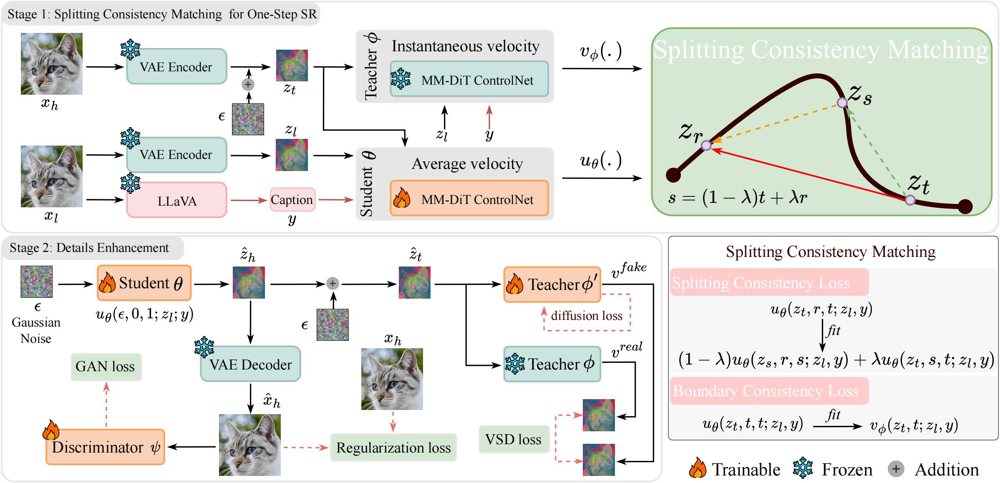
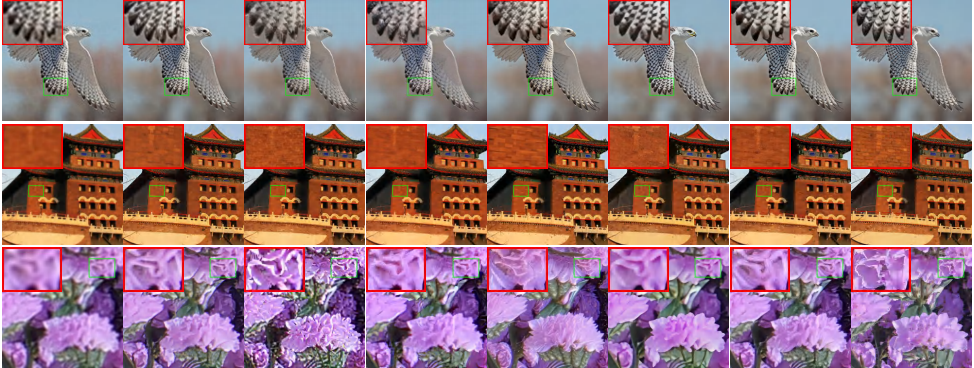

<div align="center">
  <h2>SCMSR: Splitting Consistency Matching for One-Step Real-World Image Super-Resolution</h2>

  <p>
    Wei Zhu<sup>1</sup>&nbsp;&nbsp;&nbsp;&nbsp;
    Yu Zheng<sup>1</sup>&nbsp;&nbsp;&nbsp;&nbsp;
    Lei Luo<sup>1</sup>&nbsp;&nbsp;&nbsp;&nbsp;
    Kai Zhang<sup>2,*</sup>&nbsp;&nbsp;&nbsp;&nbsp;
    Jian Yang<sup>1,2,*</sup>
  </p>

  <p>
    <sup>1</sup>Nanjing University of Science and Technology&nbsp;&nbsp;&nbsp;&nbsp;
    <sup>2</sup>Nanjing University
  </p>
</div>

## ⏰ Update
- **2026.3.8**: Create this repo.


:star: If SCMSR is helpful to you, please help star this repo. Thanks! 

## 🌟 Overview Framework
<div align="center">
  
</div>


## 😍 Visual Results
<div align="center">
  
</div>


## ⚙ Dependencies and Installation

```
## git clone this repository
git clone https://github.com/JUSTzhuzhu/SCMSR_test.git
cd SCMSR

# create an environment with python >= 3.10
conda create -n SCMSR python=3.10
conda activate SCMSR
pip install -r requirements.txt 
```


## 🍭 Inference with script
**Step 1: Download Checkpoints**

- Download the [[scmsr_f and scmsr_q](https://huggingface.co/zw121/SCMSR)] checkpoints and place them in the following directories: `preset/scmsr_f` and `preset/scmsr_q`.
- Download the [[stable-diffusion-3.5-medium](https://huggingface.co/stabilityai/stable-diffusion-3.5-medium)] checkpoints and place it in the `preset/stable-diffusion-3.5-medium` directory.
- Download the [[clip-vit-large-patch14-336](https://huggingface.co/openai/clip-vit-large-patch14-336)] and [[llava-v1.5-13b](https://huggingface.co/liuhaotian/llava-v1.5-13b)] and place them in the `llava_ckpt` directory.

**Step 2: Prepare testing data**

You can download `RealSR`, `DrealSR`  from [[SeeSR](https://drive.google.com/drive/folders/1L2VsQYQRKhWJxe6yWZU9FgBWSgBCk6mz)], and download `RealLQ250` from [[DreamClear](https://drive.google.com/file/d/16uWuJOyGMw5fbXHGcl6GOmxYJb_Szrqe/view)].

**Step 3: Running testing command**

```bash
# test w/o llava, one GPU is enough
bash scripts/test_wollava.sh

# test w/ llava, two GPUs are required
bash scripts/test_wllava.sh
```
## 🔥 Training

To be updated.


## License
This project is released under the [Apache 2.0 license](LICENSE).

## Acknowledgement
This project is based on [DiT4SR](https://github.com/Adam-duan/DiT4SR/tree/main).
Thanks for the awesome work!