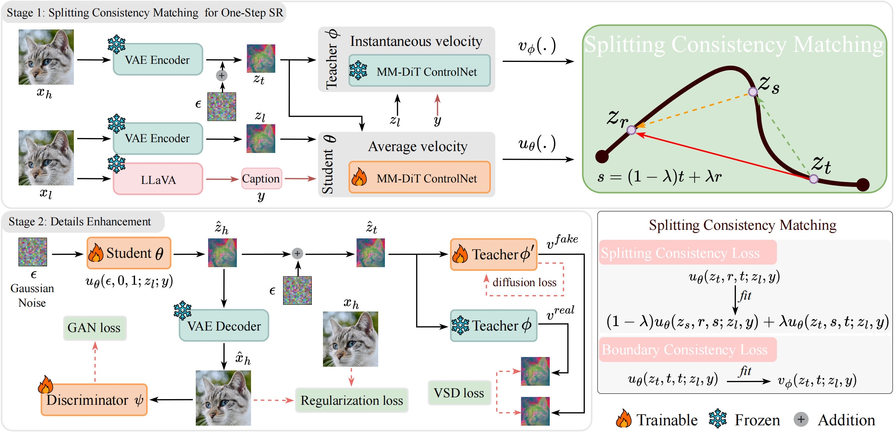
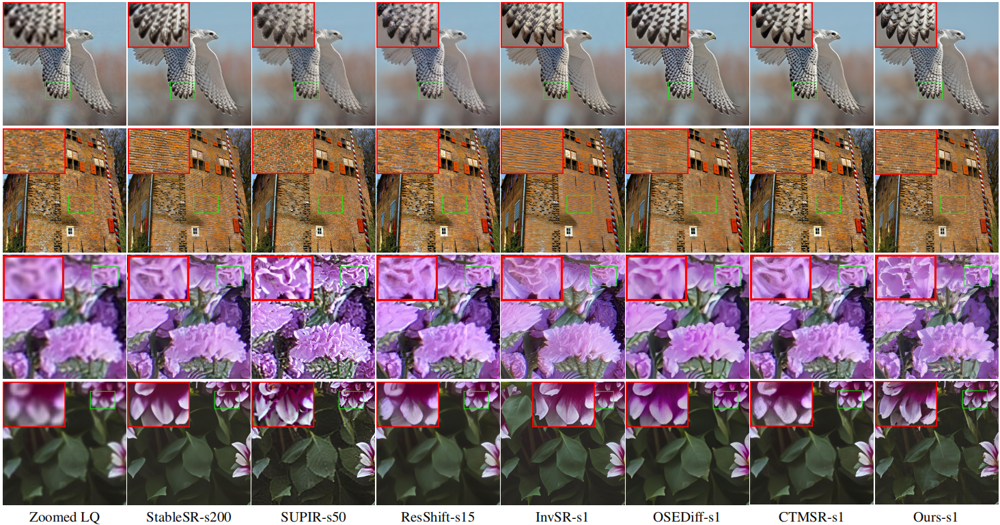

<div align="center">
  <h2>Noise-Started One-Step Real-World Super-Resolution via LR-Conditioned SplitMeanFlow and GAN Refinement </h2>

  🚩 Accepted by NeurIPS 2026 Spotlight

  <p>
    Wei Zhu<sup>1</sup>&nbsp;&nbsp;&nbsp;&nbsp;
    Kai Zhang<sup>2,*</sup>&nbsp;&nbsp;&nbsp;&nbsp;
    Yu Zheng<sup>1</sup>&nbsp;&nbsp;&nbsp;&nbsp;
    Lei Luo<sup>1,*</sup>&nbsp;&nbsp;&nbsp;&nbsp;
    Yong Guo<sup>3</sup>&nbsp;&nbsp;&nbsp;&nbsp;
    Jian Yang<sup>1,2,*</sup>
  </p>

  <p>
    <sup>1</sup>Nanjing University of Science and Technology&nbsp;&nbsp;&nbsp;&nbsp;
    <sup>2</sup>Nanjing University<br>
    <sup>3</sup>South China University of Technology
  </p>
</div>

<div align="center">
<a href='https://arxiv.org/abs/2605.09328'></a> &nbsp;&nbsp;
<a href='https://wzhu121.github.io/'></a> &nbsp;&nbsp;
<a href='https://huggingface.co/zw121/SMFSR/blob/main/SMFSR_supp.pdf'></a> &nbsp;&nbsp;

</div>

<!-- <div align="center">
  <a href="https://wzhu121.github.io/">
    
  </a>
  &nbsp;&nbsp;
  <a href="https://arxiv.org/abs/2605.09328">
    
  </a>
</div> -->

## ⏰ Update

- **2026.3.8**: Create this repo.


:star: If SCMSR is helpful to you, please help star this repo. Thanks! 

## 🌟 Overview Framework

<div align="center">
  
</div>


## 😍 Visual Results
<div align="center">
  
</div>


## ⚙ Dependencies and Installation

```
## git clone this repository
git clone https://github.com/wzhu121/SMFSR.git
cd SMFSR

# create an environment with python >= 3.10
conda create -n SMFSR python=3.10
conda activate SMFSR
pip install -r requirements.txt 
```


## 🍭 Inference with script
**Step 1: Download Checkpoints**

- Download the [[smfsr_f and smfsr_q](https://huggingface.co/zw121/SMFSR)] checkpoints and place them in the following directories: `preset/smfsr_f` and `preset/smfsr_q`.
- Download the [[stable-diffusion-3.5-medium](https://huggingface.co/stabilityai/stable-diffusion-3.5-medium)] checkpoints and place it in the `preset/stable-diffusion-3.5-medium` directory.
- Download the [[clip-vit-large-patch14-336](https://huggingface.co/openai/clip-vit-large-patch14-336)] and [[llava-v1.5-13b](https://huggingface.co/liuhaotian/llava-v1.5-13b)] and place them in the `llava_ckpt` directory.

**Step 2: Prepare testing data**

You can download `RealSR`, `DrealSR`  from [[SeeSR](https://drive.google.com/drive/folders/1L2VsQYQRKhWJxe6yWZU9FgBWSgBCk6mz)], and download `RealLQ250` from [[DreamClear](https://drive.google.com/file/d/16uWuJOyGMw5fbXHGcl6GOmxYJb_Szrqe/view)].

**Step 3: Running testing command**

```bash
# test w/o llava, one GPU is enough
bash scripts/test_wollava.sh

# test w/ llava, two GPUs are required
bash scripts/test_wllava.sh
```
## 🔥 Training

**Step 1: Download the training data**

Download the training datasets including `DIV2K`, `DIV8K`, `Flickr2K`, `Flickr8K`, and `NKUSR8K` dataset.

**Step 2: Download Teacher Checkpoint**

- Download the [[Teacher](https://huggingface.co/zw121/SMFSR/tree/main)] checkpoints and place it in the `preset` directory.

**Step 3: Prepare the training data**

- Following [[Dit4SR](https://github.com/Adam-duan/DiT4SR)], you can generate the LR-HR pairs for training.

**Data Structure After Preprocessing**

```
preset/datasets/training_datasets/ 
    └── gt
        └── 0000001.png # GT images, (3, 512, 512)
        └── ...
    └── sr_bicubic
        └── 0000001.png # Bicubic LR images, (3, 512, 512)
        └── ...
    └── prompt_txt
        └── 0000001.txt # prompts for teacher model and lora model
        └── ...
    └── prompt_embeds
        └── NULL_prompt_embeds.pt # SD3 prompt embedding tensors, (154, 4096)
        └── 0000001.pt 
        └── ...
    └── pooled_prompt_embeds
        └── NULL_pooled_prompt_embeds.pt # SD3 pooled embedding tensors, (2048,)
        └── 0000001.pt 
        └── ...
    └── latent_hr
        └── 0000001.pt # SD3 latent space tensors, (16, 64, 64)
        └── ...
    └── latent_lr
        └── 0000001.pt # SD3 latent space tensors, (16, 64, 64)
        └── ...
```

**Step 4: Start train**

Use the following command to start the training process:

```bash
bash bash/train.sh
```


## 🪪  License
This project is released under the [Apache 2.0 license](LICENSE).

## 🙏 Acknowledgement
This project is based on DiT4SR.
Thanks for the awesome work!

## 📄 Citation
If our work assists your research, feel free to give us a star ⭐ or cite us using:

```bibtex
@misc{zhu2026SMFSR,
title={Noise-Started One-Step Real-World Super-Resolution via LR-Conditioned SplitMeanFlow and GAN Refinement}, 
author={Wei Zhu and Kai Zhang and Yu Zheng and Lei Luo and Yong Guo and Jian Yang},
journal={arXiv preprint arXiv:2605.09328},
year={2026}
}
```